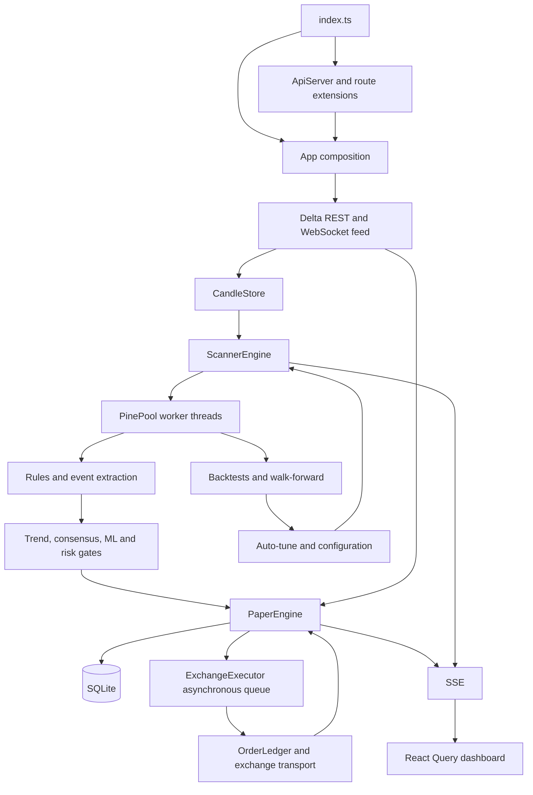

**VNEdge architecture walkthrough and review — 28 September 2026**

Review baseline: `c9a2f49`. This is an assessment of the local implementation, not an audit of an exchange account or a running deployment. This review changed no application code or configuration. Existing untracked research/import files were left alone. Concurrent market-gate and dashboard edits appeared near the end of the review; their diffs were inspected for overlap, but their new behavior is outside this assessment and the reported baseline test run. Local line numbers can move as that work continues.

**Assessment**

The project has a useful modular monolith foundation: isolated Pine workers, reusable fill calculations, a portfolio risk gate, an exchange transport abstraction, a persistent order ledger, and synthetic integration tests. SQLite and a single deployable server are reasonable choices here.

The principal weakness is state ownership. A simulated fill becomes an account fact before the exchange confirms it; configuration can describe a transport different from the one actually running; and validation can evaluate a strategy different from the one deployed. Several local fixes in comments and tests address individual incidents, but the boundaries still permit these contradictions.

The highest-priority findings below concern exchange-backed execution. The pair-selection, validation, storage, scheduling, and event-loop issues also affect paper operation.

**How execution flows through the code**

1. **Bootstrap.** [index.ts](/Users/scorpion/Desktop/Vela_VNEdge/server/src/index.ts:10) constructs `App` and `ApiServer`, opens the HTTP listener, then starts the app. `App` directly constructs configuration, SQLite, candle storage, Pine workers, two paper books, ML, scanners, incubator, risk, execution, and operations. Constructors already install listeners and some timers.
2. **Market data.** [CandleStore](/Users/scorpion/Desktop/Vela_VNEdge/server/src/data/candleStore.ts:120) backfills and subscribes series, merges updates, and emits forming/closed bars. The closed-bar watermark is in memory. Reconnect and gap repair announce the latest unannounced closed bar. Quotes, tape, marks, and funding also reach the paper books through [realtime wiring](/Users/scorpion/Desktop/Vela_VNEdge/server/src/execution/wiring.ts:18).
3. **Strategy evaluation.** [ScannerEngine.runOnce](/Users/scorpion/Desktop/Vela_VNEdge/server/src/scanners/engine.ts:361) snapshots bars, executes the Pine source in a worker, derives events from alerts/shapes/labels/plots, persists backtests, and applies live events. A live run evaluates a history window again; `tailBars` limits returned events, not the Pine calculation itself.
4. **Decision and accounting.** [handleLiveEvent](/Users/scorpion/Desktop/Vela_VNEdge/server/src/scanners/engine.ts:466) inserts a deduplicated signal, calculates ML features, applies entry gates, and calls `PaperEngine`. The paper engine sizes against its account, persists simulated fills, and synchronously emits order/position/trade events. Risk and ML consume this paper state.
5. **Exchange execution.** [ExchangeExecutor](/Users/scorpion/Desktop/Vela_VNEdge/server/src/execution/testnet.ts:82) subscribes to paper events, serializes work onto a promise queue, writes an order intent, sends it, confirms it, and restates paper prices/quantities. Periodic sweeps adopt some external fills; reconciliation primarily reports drift.
6. **Research and promotion.** Warm backtests, walk-forward validation, ML training, the validation shadow ledger, and the incubator share the live process and database. Auto-tuning writes scanner configuration. Incubator approval writes both configuration and stage history.
7. **Dashboard.** The HTTP server exposes REST snapshots and SSE updates. React Query holds dashboard state; SSE handlers update or invalidate caches. Server and browser contracts are independently declared.

**Findings, ordered by remediation priority**

**1. P1 — Simulated closure can remove protection from exposure that the exchange still holds.**

Evidence: [paper close/persistence](/Users/scorpion/Desktop/Vela_VNEdge/server/src/paper/engine.ts:728), [marketExit](/Users/scorpion/Desktop/Vela_VNEdge/server/src/execution/testnet.ts:208), [onPosition](/Users/scorpion/Desktop/Vela_VNEdge/server/src/execution/testnet.ts:240), [restateFill](/Users/scorpion/Desktop/Vela_VNEdge/server/src/paper/engine.ts:534).

`PaperEngine` marks a position closed and emits its exit order before exchange confirmation. If the exchange rejects the exit, `marketExit()` logs the discrepancy and returns. The next queued `closed` position event still calls `cancelBracket()`. Risk sees no open paper position, while the exchange may retain the entire exposure without its previous protection.

Partial discretionary fills have the same ownership problem: confirmation returns the filled quantity, but `marketExit()` restates only price and fee. It neither preserves the residual quantity nor retries it. The paper position remains fully closed and its brackets are cancelled. Separately, live ML samples and risk cooldowns are generated from the first simulated `trade` event; later fill restatements do not replay a corrected trade event to those consumers.

**Reproduced:** a rejected manual exit cancelled all four resting protective orders; an exit filled for half the position left the paper quantity at zero and no resting protection.

**Fix:** introduce explicit entry-pending/open/exit-pending/closed execution states. In exchange mode, confirmed cumulative fills must own position quantity and realized P&L. Retain protection until remaining exposure is confirmed zero. Make accounting corrections idempotent and visible to risk, ML, and projections.

**2. P1 — Changing execution mode changes the label but does not change the running transport.**

Evidence: [executor creation](/Users/scorpion/Desktop/Vela_VNEdge/server/src/app.ts:126), [configuration refresh](/Users/scorpion/Desktop/Vela_VNEdge/server/src/app.ts:178), [dynamic mode getter](/Users/scorpion/Desktop/Vela_VNEdge/server/src/execution/testnet.ts:78), [factory](/Users/scorpion/Desktop/Vela_VNEdge/server/src/execution/testnet.ts:520).

The executor and transport are constructed once. Configuration updates refresh subscriptions/scanners but do not stop, replace, or drain the executor. Its reported `mode` reads current configuration; its writes use the original transport. Thus switching testnet to paper/dry-run can continue exchange writes, while switching paper to testnet leaves `executor === null`. Host selection and production opt-in are likewise resolved during construction.

**Reproduced:** after changing the fixture configuration to `paper`, executor status reported paper while a new entry was sent through the existing fake exchange transport.

**Fix:** initially reject changes to execution mode/host/bracket lifecycle settings while running and explicitly require restart. A later runtime transition can halt admission, drain/reconcile, rebuild the adapter, verify effective settings, and resume. Report requested and effective configuration separately.

**3. P1 — Reset and emergency flatten bypass a unified account lifecycle.**

Evidence: [reset endpoint](/Users/scorpion/Desktop/Vela_VNEdge/server/src/api/server.ts:304), [PaperEngine.reset](/Users/scorpion/Desktop/Vela_VNEdge/server/src/paper/engine.ts:581), [execution routes](/Users/scorpion/Desktop/Vela_VNEdge/server/src/risk/routes.ts:11), [exchange closeAll](/Users/scorpion/Desktop/Vela_VNEdge/server/src/execution/testnet.ts:485).

The paper reset endpoint is available regardless of execution mode. Reset archives the paper rows and clears in-memory exposure without flattening the exchange or notifying the executor through position events. The exchange close-all endpoint has the opposite problem: it cancels brackets and sends market closes outside the executor queue, without first halting scanner admission, awaiting queued entries, or confirming that positions are flat. Its response can contain submitted/rejected orders in a field named `closed`.

**Reproduced:** reset left one executor bracket and four exchange orders while the paper book reported zero open positions. The close-all concurrency issue is established by the call path, not an exchange test.

**Fix:** have one account coordinator implement halt → prevent/cancel new intents → settle in-flight work → flatten → verify → archive/reset. Keep paper reset separate from an exchange-backed account reset. Keep the account halted when flattening is incomplete.

**4. P1 — Signal, position, fill, and execution intent are not one recoverable transaction.**

Evidence: [signal insertion and dedupe](/Users/scorpion/Desktop/Vela_VNEdge/server/src/scanners/engine.ts:467), [openAt](/Users/scorpion/Desktop/Vela_VNEdge/server/src/paper/engine.ts:290), [applyFills](/Users/scorpion/Desktop/Vela_VNEdge/server/src/paper/engine.ts:728), [asynchronous execution queue](/Users/scorpion/Desktop/Vela_VNEdge/server/src/execution/testnet.ts:102), [recovery of unmirrored positions](/Users/scorpion/Desktop/Vela_VNEdge/server/src/execution/testnet.ts:396).

A signal is committed before its decision; the open position and entry fill are separate writes; exchange intent is persisted only when the later queued callback runs. A crash can therefore leave a deduplicated signal with no completed action, an open position without an order, or a paper fill with no durable exchange intent. Recovery explicitly leaves positions without exchange history unmirrored rather than recovering an intended action.

**Reproduced:** injecting a failure at `INSERT INTO orders` left an open position committed in SQLite with zero order rows; a new `PaperEngine` reloaded it as open.

**Fix:** use a transaction for the decision, account mutation, and durable outbox item. Dispatch external work from the outbox with stable intent IDs. Publish notifications only after commit. Recovery must resume incomplete decisions rather than treating the mere presence of a signal as completed processing.

**5. P1 — The configuration model cannot represent the pairs that the tuner approves.**

Evidence: [requiredSeries](/Users/scorpion/Desktop/Vela_VNEdge/server/src/scanners/engine.ts:137), [autoTune projection](/Users/scorpion/Desktop/Vela_VNEdge/server/src/scanners/engine.ts:245), [incubator livePairs](/Users/scorpion/Desktop/Vela_VNEdge/server/src/incubator/cycle.ts:24), [promotion](/Users/scorpion/Desktop/Vela_VNEdge/server/src/incubator/cycle.ts:188).

The tuner evaluates `(scanner, symbol, timeframe)` tuples but saves separate symbol and timeframe lists. Scheduling takes their Cartesian product. If BTC/15m and ETH/1h pass, BTC/1h and ETH/15m become enabled too—even when they explicitly failed.

Incubator bookkeeping repeats the identity mismatch: `livePairs()` assigns `cfg.incubator.tf` to every scanner instead of using its deployed timeframes. Promotion replaces the scanner-wide timeframe list with `[r.tf]`, potentially moving all its existing markets to the newly promoted pair's timeframe.

**Reproduced:** exactly two passing tuples generated four scheduled tuples, including a tuple whose decision was `keep: false`.

**Fix:** make an explicit deployment tuple the canonical entity. Tuning, subscription requirements, incubator stages, promotion limits, evidence, and execution should reference the same tuple ID and strategy revision.

**6. P1 — Live, warm-backtest, and walk-forward paths evaluate different strategy specifications.**

Evidence: [live worker job](/Users/scorpion/Desktop/Vela_VNEdge/server/src/scanners/engine.ts:387), [warm-backtest invocation](/Users/scorpion/Desktop/Vela_VNEdge/server/src/scanners/engine.ts:413), [walk-forward job and extraction](/Users/scorpion/Desktop/Vela_VNEdge/server/src/validation/service.ts:152), [backtest input contract](/Users/scorpion/Desktop/Vela_VNEdge/server/src/paper/backtest.ts:21), [live trend override](/Users/scorpion/Desktop/Vela_VNEdge/server/src/scanners/engine.ts:455).

Live jobs pass the scanner timezone and event-source selection. Walk-forward jobs omit timezone and extract events without `sc.sources`. The backtest engine supports `scannerExit` and scanner-specific `trendGate`, but the main warm-backtest invocation does not pass them. The walk-forward interface also lacks these scanner-specific inputs. Consequently, OOS results can select a different signal/exit system from the one actually trading.

Sharing `logic.ts` is valuable, but sharing arithmetic does not guarantee identical orchestration or inputs.

**Fix:** resolve one immutable `StrategySpec` containing source, patches, inputs, timezone, event sources, entry gates, exits, and execution assumptions. Pass it through live, replay, shadow, and walk-forward paths. Add parity tests where overrides deliberately differ from defaults.

**7. P1 — Research artifacts and secondary market data lack sufficient identity.**

Evidence: [backtest load](/Users/scorpion/Desktop/Vela_VNEdge/server/src/scanners/engine.ts:99), [warm cache shortcut](/Users/scorpion/Desktop/Vela_VNEdge/server/src/scanners/engine.ts:322), [walk-forward lookup](/Users/scorpion/Desktop/Vela_VNEdge/server/src/validation/service.ts:59), [worker secondary-data cache](/Users/scorpion/Desktop/Vela_VNEdge/server/src/pine/worker.ts:54).

Backtests and walk-forward results are keyed by scanner/symbol/timeframe and checked against a global simulation version. They are not tied to a source hash, input overrides, timezone, sources, fees, or exit settings. A source/config change can therefore retain an old OOS verdict. The warmed set and one-hour shortcut also do not encode that revision.

Secondary candle caching has a related defect: the worker cache key uses symbol/timeframe and a TTL/length check, but ignores the requested `endMs`. A job for another historical period can reuse a series for the wrong range. Provider clipping removes later bar starts, but cannot reconstruct missing earlier history or undo already-finalized values in a partially overlapping higher-timeframe candle.

**Fix:** fingerprint strategy specification, runtime version, market metadata, simulation assumptions, and data range. Require matching evidence at promotion. Key secondary data by covered range/closed state, verify coverage, and support immutable replay datasets.

**8. P1 — Heavy research still blocks the thread responsible for live trading.**

Evidence: [ML train](/Users/scorpion/Desktop/Vela_VNEdge/server/src/ml/service.ts:101), [gradient training](/Users/scorpion/Desktop/Vela_VNEdge/server/src/ml/model.ts:79), [quadratic AUC](/Users/scorpion/Desktop/Vela_VNEdge/server/src/ml/model.ts:125), [walk-forward execution](/Users/scorpion/Desktop/Vela_VNEdge/server/src/validation/service.ts:165), [warm replay](/Users/scorpion/Desktop/Vela_VNEdge/server/src/scanners/engine.ts:413).

Pine evaluation is isolated, but ML training and trade replay run synchronously in the server process. ML training loads up to 100,000 samples, performs global and per-scanner optimization, and calculates AUC using every positive/negative pair. These computations block feed processing, order confirmations, risk timers, API responses, and worker-result handling. Worker queue priority cannot protect against work outside the pool. Synchronous database work and JSON serialization add contention.

This is a structural latency risk; this review did not benchmark worst-case event-loop pauses.

**Fix:** move training and replay to a separate research worker/process with bounded jobs. Return versioned artifacts for the live process to adopt. Replace pairwise AUC with a sort/rank implementation. Keep live decision work and account writes bounded.

**9. P2 — Backpressure discards trading events without distinguishing entries from exits.**

Evidence: [queue skip](/Users/scorpion/Desktop/Vela_VNEdge/server/src/scanners/engine.ts:349), [deferred coalescing](/Users/scorpion/Desktop/Vela_VNEdge/server/src/scanners/engine.ts:361), [age filter and latest-bar extraction](/Users/scorpion/Desktop/Vela_VNEdge/server/src/scanners/engine.ts:424).

At more than 500 queued live jobs the entire bar is skipped. A busy tuple retains only one deferred request, and the next run extracts events only from its newest closed bar. If multiple bars pass, intermediate script exits are lost. The signal-age gate returns before processing exits as well as entries. Existing price-level stops may still operate, but they do not replace a lost discretionary script exit.

**Fix:** persist a processed-bar watermark per deployment, distinguish entry expiry from exit handling, and define an explicit catch-up policy. Reserve capacity for managing existing exposure. On lag, halt new entries or reduce the fleet instead of quietly losing its management events.

**10. P1 — Shutdown drains Pine jobs, not the full trading lifecycle.**

Evidence: [ops shutdown](/Users/scorpion/Desktop/Vela_VNEdge/server/src/ops/service.ts:104), [App.stop](/Users/scorpion/Desktop/Vela_VNEdge/server/src/app.ts:465), [executor stop/flush](/Users/scorpion/Desktop/Vela_VNEdge/server/src/execution/testnet.ts:100), [process exit](/Users/scorpion/Desktop/Vela_VNEdge/server/src/index.ts:23).

Shutdown waits for Pine queue/busy counts while the market feed and scanner event producers are still active. It does not await the executor queue; executor `stop()` only clears its intervals. The process then exits. An accepted worker decision or persisted paper fill can therefore outlive the checked queue and be interrupted during exchange execution. Realtime, validation, ML, and scanner-retune timers also lack a common dispose lifecycle.

Validation construction is hidden inside HTTP route registration through `attachValidation()`, so constructing an API server changes the trading graph. This makes lifecycle ownership and headless behavior harder to reason about.

**Fix:** give each component explicit start, quiesce, drain, and dispose contracts. Stop new decisions first, preserve required exposure management while settling orders, drain durable execution work, persist unresolved state, then stop feeds/workers/database. Move validation composition into `App` or a dedicated runtime builder.

**11. P2 — Calibrated model metrics reuse the data that fitted the calibration.**

Evidence: [trainLogReg](/Users/scorpion/Desktop/Vela_VNEdge/server/src/ml/model.ts:91).

The oldest samples train logistic regression and the newest holdout produces raw predictions. That same holdout then fits Platt scaling and measures calibrated Brier/log loss/reliability. The raw base-model holdout is separate from its fit; the calibrated metrics are not an independent test of the complete deployed model.

**Fix:** use chronological training, calibration, and final evaluation partitions, or rolling out-of-fold calibration with an untouched evaluation window. Persist model/feature/spec versions and separate calibration-fit diagnostics from final evaluation metrics.

**12. P2 — Independent API/event contracts already create incorrect UI state.**

Evidence: [server void event](/Users/scorpion/Desktop/Vela_VNEdge/server/src/paper/engine.ts:500), [browser event union](/Users/scorpion/Desktop/Vela_VNEdge/dashboard/src/api/types.ts:389), [browser position reducer](/Users/scorpion/Desktop/Vela_VNEdge/dashboard/src/sse/SSEProvider.tsx:133), [position polling](/Users/scorpion/Desktop/Vela_VNEdge/dashboard/src/api/queries.ts:91).

The server emits `type: 'voided'` for rejected exchange entries. The browser union only declares opened/updated/closed, and the reducer only removes closed positions. A voided position is therefore retained or inserted as open until a later snapshot corrects it. Runtime SSE data is cast to the declared type without checking it.

SSE also writes to every response without checking the write return value, so a slow connected client can accumulate buffered data in the same process that trades. Authentication is checked at connection establishment; stream revocation is not part of the broadcaster lifecycle.

**Fix:** share a discriminated event schema and test all variants end to end. Use bounded/coalesced client buffers and disconnect lagging clients. Associate streams with sessions and close them on revocation/expiry.

**Additional operational concern: readiness and clock ownership**

[App.health](/Users/scorpion/Desktop/Vela_VNEdge/server/src/app.ts:187) always reports `status: 'ok'`, even though dependency health is included in other fields, and [uncaught exceptions](/Users/scorpion/Desktop/Vela_VNEdge/server/src/app.ts:130) are logged while the process continues. Monitoring must parse the detailed fields to detect a degraded trading runtime; the top-level status is not a readiness guarantee. Make readiness depend on required market data, reconciliation, and execution state, and use a controlled halt/restart policy after an unexpected invariant failure.

Time is partly injected and partly read directly from `Date.now()`. The existing weekly risk test uses a September 22 clock, but a kill-triggered `paper.closeAll()` stamps exits using real time. On September 28, that nested trade can advance the risk week and clear the condition the test expects. A single runtime clock shared by engines, risk, execution, and tests would remove this discrepancy and make replay behavior more reliable.

**Verification performed**

- `npx tsc --noEmit -p server/tsconfig.json`: passed.
- Existing server unit and integration suite, with concurrency 2: **239 tests, 238 passed, 1 failed** on local Node **v25.5.0**. CI targets Node 22/24; those versions were not rerun here.
- Failure: `server/src/risk/manager.test.ts:65`, weekly kill-switch assertion at line 70. An isolated copy with wall clock frozen to the fixture date passed all **12 risk tests**. This supports the mixed-clock explanation; it is not evidence that the deployed kill switch is universally broken.
- Six isolated reproductions using the existing fake exchange and in-memory SQLite all confirmed the undesirable behavior described in findings 1–5. The assertions intentionally check for the defect, so their passing is confirmation of a problem, not acceptance testing of a fix.
- No real exchange writes, production API calls, or live-process restart was performed. No complete Pine-catalog compatibility/repainting audit or production load test was performed.

Temporary reproduction files: [execution and storage probes](/tmp/vela-execution-audit.test.ts), [pair-selection probe](/tmp/vela-tuning-audit.test.ts), [frozen-clock risk suite](/tmp/vela-risk-frozen-audit.test.ts), [existing-suite output](/tmp/vela-architecture-tests.log). These paths are temporary and may be cleaned by the operating system.

**Recommended implementation order**

1. Contain execution risk: preserve protective orders after failed/partial exits, reject unsafe runtime mode transitions, and prohibit uncoordinated exchange-book resets. Make emergency flatten halt and settle the executor.
2. Establish account authority: persistent intent/fill state machine, atomic outbox, confirmed-quantity accounting, idempotent recovery, and lifecycle-aware shutdown.
3. Establish strategy authority: explicit deployment tuples, one resolved strategy specification, versioned evidence, and parity tests across evaluation paths.
4. Isolate heavy research computation and add bounded scheduling with separate entry/exit lag policies.
5. Repair evaluation metrics, shared event contracts, readiness, stream lifecycle, and clock injection.

Keep the modular monolith initially. The useful architectural change is to establish ownership of state and isolate expensive computation; splitting every folder into a service would leave these correctness defects intact while adding distributed failure modes.
