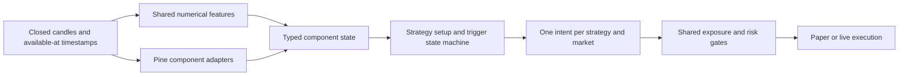

# Scanner combinations and strategy design — 28 September 2026

> **29 September test update:** The four proposals below have now been backtested. Trend continuation and range return lost in both halves on BTC, ETH and SOL; exact-level sweep reclaim was negative and sparse; compression breakout was positive on only eight trades. None merits live promotion from this evidence. See the [corrected validation report](/Users/scorpion/Desktop/Vela_VNEdge/docs/COMPOSITE-VALIDATION-2026-09-29.md). The implementation priorities below are the original research hypotheses, not recommendations supported by the subsequent results.

**Yes: the library can support several coherent composite strategies. Build four role-based strategies first, and keep the existing contrarian family as an experimental benchmark. Combining every scanner that says “buy” will mostly multiply correlated signals and inconsistent meanings. No combination in this study is established as profitable.**

This is a source and evidence study, with fresh offline runtime probes. Production scanner sources, trading configuration, and exchange state were not changed.

## 1. Coverage and what the counts actually mean

The current registry contains **2,591 entries**, rather than 800. The audit inspected every registry entry and its available source using whole-source automated triage, then manually examined the shortlisted formulas, output channels, sequencing, and the existing combination experiment. It is not a claim that all 700,571 source lines received manual semantic verification.

| Inventory | Count | Interpretation |
|---|---:|---|
| Available source entries | 2,237 | 700,571 source lines across catalog entries, including duplicate imports |
| Registry `ok` | 1,617 | Eligible in the registry; not fresh certification |
| Registry incompatible | 620 | Requires runtime/compatibility repair before strategy use |
| Source unavailable | 354 | Cannot establish behavior from source |
| Scanners with stored runtime profiles | 349 | 1,047 profile rows across timeframes |
| Scanners in the historical `all800` sweep evidence | 390 | 3,171 triage rows; stage 2 covers 36 of those IDs |
| Stored backtests | 9,676 | 1,110 version 4, 143 version 3, 8,423 unversioned |
| Normalized-code duplicate groups | 15 | 17 excess catalog entries; candidate duplicates, not a full semantic clone search |

Backtest version 4 matches the current simulation version, but a version number does not establish matching source, inputs, adapter, or configuration. The older compatibility report contains 1,630 rows and cannot certify the expanded catalog. Historical profiles, compatibility status, and current registry status are distinct evidence sources.

**Per-scanner deliverables:** [searchable catalog](/Users/scorpion/Desktop/Vela_VNEdge/_research/scanner-combinations-20260928/catalog.html), [complete machine-readable catalog](/Users/scorpion/Desktop/Vela_VNEdge/_research/scanner-combinations-20260928/catalog.json), and [reproducible audit](/Users/scorpion/Desktop/Vela_VNEdge/_research/scanner-combinations-20260928/audit.mjs). Each catalog row includes source identity, inferred roles, output evidence, temporal hazards, compatibility, profiles, and backtest coverage. The catalog deliberately distinguishes automated triage from the manual review below.

### Whole-library grouping

These are heuristic primary-family assignments; one script can contain several roles. Counts describe the inventory, not the number of independent trading ideas.

| Primary family | Entries | Appropriate use in a strategy |
|---|---:|---|
| Trend / trailing systems | 543 | Direction or trailing exit; usually choose one representative |
| Liquidity / market structure | 331 | Location, sweep/reclaim setup, structural invalidation |
| Anchored value / profiles | 187 | Entry location or value target |
| Momentum | 184 | Confirmation, usually correlated with trend filters |
| Compression / breakout | 173 | Setup followed by release or breakout trigger |
| Session / price patterns | 155 | Time-limited setup, with an explicit timezone |
| Regime | 128 | Decide which strategy is allowed to trade |
| Volume / flow proxies | 126 | Participation; verify whether “delta” is measured or inferred |
| Mean reversion | 65 | Stretch and return-to-value triggers |
| External context | 32 | Requires point-in-time external data coverage |
| Risk / utilities | 17 | Sizing, exits, display; usually not a directional vote |
| Unclassified | 296 | Individual semantic review required |
| Unavailable | 354 | Exclude until source is available |

The family rules use names and source primitives, so ambiguous scripts remain provisional. For example, a moving average inside a more complex script does not prove that its main function is trend following.

## 2. The combinations worth building

Priorities below reflect semantic fit and implementation clarity, **not ranked expected returns**. Thresholds and timeframes are proposed initial research specifications, not optimized parameters. Freeze them before the next evaluation.

| Priority | Strategy | Components to combine | Why the components fit |
|---|---|---|---|
| 1 | Trend continuation after pullback | Zero Lag Trend Signals + Dynamic Trend Bands / Anchored VWAP Signals | A slower direction state gates a faster, localized continuation event |
| 2 | Compression-release breakout | Squeeze Index + High Volume Breakout Targets + explicit relative volume | Compression identifies the setup; a structural break supplies direction; actual relative volume checks participation |
| 3 | Liquidity sweep and reclaim | Liquidity Sweep Filter + Range Oscillator + Market Regime Engine's ER branch | Sweep identifies location, oscillator establishes stretch, regime avoids fading a strong trend |
| 4 | Range return to value | Market Regime Engine's ER branch + Range Oscillator | Regime enables mean reversion; oscillator supplies both stretch and a coherent value centre |
| Benchmark | Existing 4h trigger + contrarian family | Liquidity Entry Zones strategy 2.0 + saved family7 | Some historical results justify a clean retest, but the current selection procedure leaks information |

### Strategy 1 — trend continuation after pullback

**Components:** `zero-lag-trend-signals-mtf` for direction; `dynamic-trend-bands-anchored-vwap-signals` for the trigger.

**Proposed first specification:** use the last completed 1h Zero Lag `trend` state and a 15m Dynamic Trend Bands event. A long requires the 1h state to be +1 and a newly emitted `Break Up Triangle` event on the completed 15m bar. A short requires -1 and `Break Dn Triangle`. Enter at the next tradable 15m open, with costs and gaps modeled. One event per component/bar/side, one composite position per market. The trigger expires after that next bar; it is not a permanent vote.

Start with a common exit baseline: stop 1.5 × completed-bar ATR(14) from the actual entry, target 2R, time exit after 24 entry-timeframe bars. Then test a separately versioned structural-stop variant using the pullback extreme known at the signal time. Do not inherit each component's position sizing or open separate trades for each scanner.

**What source review established:** Zero Lag uses a lag-adjusted EMA(70), an ATR-based band and a persistent direction state. Its local basis-cross entry condition is different from its trend flip. It also emits alerts for five other timeframes. The Dynamic Trend Bands script maintains a trend state and pivot-anchored VWAP drawings, then emits continuation events when price meets the anchored line. Its displayed signed volume is inferred from candle direction, not trade-by-trade aggressor flow.

**Integration work:** expose Zero Lag's local numeric `trend`; explicitly evaluate closed 1h bars instead of pooling its five MTF alerts. Whitelist the Dynamic script's primary event and make event time the confirmation bar. Its duplicate plot titles and historical polylines are unsuitable as an automatic line-selection contract. A later relative-volume filter is an ablation, not a mandatory third trend indicator.

Sources: [Zero Lag state and MTF calculations](/Users/scorpion/Desktop/Vela_VNEdge/scripts/pine/tHK4O1Fi-Zero-Lag-Trend-Signals-MTF-AlgoAlpha.pine:25), [Dynamic bands and anchored state](/Users/scorpion/Desktop/Vela_VNEdge/scripts/pine/pYlVdSoZ-Dynamic-Trend-Bands-Anchored-VWAP-Signals-BigBeluga.pine:25), [explicit trigger shapes](/Users/scorpion/Desktop/Vela_VNEdge/scripts/pine/pYlVdSoZ-Dynamic-Trend-Bands-Anchored-VWAP-Signals-BigBeluga.pine:167).

### Strategy 2 — compression-release breakout

**Components:** `squeeze-index`, `high-volume-breakout-targets`, and the common candle feature `volume / SMA(volume, 20)`.

**Proposed first specification:** all components on completed 1h bars. Arm when Squeeze Index `PSI > 80`. If PSI crosses back below 80, open a release window of three bars, counting the release bar. During that window, require a new bullish or bearish zone-breakout event from High Volume Breakout Targets and relative volume ≥1.2. Cancel the window on expiry or re-entry into compression. The breakout sets direction; PSI does not. Enter next open and consume the setup once. Use the same ATR stop / 2R target / 24-bar time exit baseline as Strategy 1.

An explicitly separate structural variant can stop beyond the broken zone's opposite boundary plus 0.1 ATR, using only the zone available at confirmation. It requires exporting the zone boundary and cannot be reconstructed from a future chart screenshot.

**Critical source finding:** the “High Volume” script qualifies a breakout by close beyond the zone and at least 40% of the candle range beyond its boundary. Volume primarily affects its drawings; there is no high-volume requirement in that qualifying condition. Its three drawn targets divide the zone height into thirds. Those drawings do not automatically become structured executable stop/target data in VNEdge.

**Why not add both Squeeze & Release and Squeeze Momentum Oscillator?** Their compression calculation shares smoothed ATR contraction logic. The momentum version already embeds that concept. Use one compression implementation at a time; test alternatives under a separate strategy version. Volume Energy Reservoirs is another compound compression/participation candidate, not a fourth independent confirmation to stack automatically.

Sources: [PSI formula](/Users/scorpion/Desktop/Vela_VNEdge/scripts/pine/Et6YD2t4-Squeeze-Index-LuxAlgo.pine:20), [breakout qualification](/Users/scorpion/Desktop/Vela_VNEdge/scripts/pine/C7P8RWwU-High-Volume-Breakout-Targets-AlgoAlpha.pine:188), [Squeeze & Release](/Users/scorpion/Desktop/Vela_VNEdge/scripts/pine/2rpsjnzA-Squeeze-Release-AlgoAlpha.pine:1), [Squeeze Momentum](/Users/scorpion/Desktop/Vela_VNEdge/scripts/pine/WDsx1YV1-Squeeze-Momentum-Oscillator-AlgoAlpha.pine:1).

### Strategy 3 — liquidity sweep and reclaim

**Components:** `liquidity-sweep-filter`, `range-oscillator-zeiierman`, `market-regime-engine`.

**Proposed first specification:** completed 1h bars, using only the Market Regime ER branch. At the sweep bar require ER <0.35. For a long, a bullish valley-sweep event must coincide with Range Oscillator ≤−100. Store the swept level and sweep low. Require a completed close back above the swept level within two bars, including the sweep bar, while the regime remains ranging. For a short, mirror the rules with a peak sweep, oscillator ≥+100, and close back below the level. Enter next open. Expire the setup after two bars; consume it once.

Stop beyond the stored sweep extreme by 0.1 ATR(14); target 2R; time exit after 12 bars. Reject entry if a gap places the stop on the wrong side of the fill. Opposite setups cancel an unfilled setup; they do not create offsetting positions. Compare this structural exit against the common ATR baseline during ablation.

**Why the additional reclaim matters:** Liquidity Sweep Filter detects price crossing stored peaks/valleys and accumulates volume proxies; the sweep alone does not require a closing reclaim. Its bullish/bearish trend alerts are separate channels. Treating every bullish alert as the same entry erases that distinction. Its “liquidation” language does not mean it consumes actual liquidation-feed data.

**Integration work:** expose swept level, swept extreme, event identity and confirmation time. The current generic event extraction cannot invent those missing fields. Keep ordinary and strong sweep classes as separate test variants; do not duplicate an event because both a shape and alert describe it.

Sources: [sweep implementation](/Users/scorpion/Desktop/Vela_VNEdge/scripts/pine/rDS0kick-Liquidity-Sweep-Filter-AlgoAlpha.pine:1), [distinct sweep and trend alert channels](/Users/scorpion/Desktop/Vela_VNEdge/scripts/pine/rDS0kick-Liquidity-Sweep-Filter-AlgoAlpha.pine:234), [Range Oscillator](/Users/scorpion/Desktop/Vela_VNEdge/scripts/pine/mlL8CpJq-Range-Oscillator-Zeiierman.pine:1).

### Strategy 4 — range return to value

**Components:** `market-regime-engine` and `range-oscillator-zeiierman`. Two components are enough for the initial version.

**Proposed first specification:** completed 1h bars. Require ER <0.35 at setup and entry. Arm a long after oscillator ≤−100; trigger when it crosses back above −100 within three bars. Mirror at +100 for shorts. Enter next open, stop beyond the stretch episode's extreme by 0.1 ATR, and target the oscillator's weighted mean captured at the trigger. Reject if the target is no longer in the profitable direction at entry. Exit at the next open after a confirmed regime change or after 12 bars, whichever comes first, unless the resting stop/target was hit earlier.

The oscillator is `100 × (close − weightedMean) / (2 × ATR)`. Its ±100 thresholds represent its range envelope; generic RSI 30/70 thresholds are inappropriate. Its centre is a return-weighted mean, **not VWAP**. It uses ATR(2000) with an ATR(200) fallback, so warm-up policy and the switch between those periods must be recorded. The fresh 1,454-bar probe exercised the fallback regime, not the mature 2,000-bar branch.

Do not demand a bullish trend vote to enter this range-fading strategy. That would mix contradictory assumptions. A future strategy router should enable either trend continuation or range fading based on completed-bar state, with shared market exposure limits.

Source: [regime ER calculation](/Users/scorpion/Desktop/Vela_VNEdge/scripts/pine/MIEZDvM9-Market-Regime-Engine.pine:53).

## 3. Manual shortlist findings and readiness

| Component | Appropriate contract | Evidence / work still needed |
|---|---|---|
| Zero Lag Trend Signals | Persistent local direction; separate primary entry event | Stored profiles produce entries; unoffset MTF requests and multiple alert channels require explicit handling |
| Dynamic Trend Bands / Anchored VWAP | Confirmed continuation event plus anchored context | Stored profiles produce entries; expose numeric anchor state and distinguish duplicate plot titles |
| Squeeze Index | Compression intensity, directionless | Fresh offline run passed; PSI and explicit threshold available |
| Squeeze & Release | Volatility contraction / release | Fresh run passed; unnamed plots need a stable adapter; positive value is not a bullish price signal |
| Squeeze Momentum Oscillator | Combined compression and momentum | Fresh run passed; overlaps Squeeze & Release; pivot divergence must be timed at confirmation |
| High Volume Breakout Targets | Confirmed structural breakout | Fresh run passed; requires separate actual volume gate and explicit level export |
| Range Oscillator | Stretch, re-entry, value centre | Fresh run passed; correct units and warm-up required |
| Liquidity Sweep Filter | Sweep setup, not automatic reclaim | Fresh run passed; export levels and allowlist sweep channels |
| Market Regime Engine | ER regime and EMA direction | Fresh run passed, but volatility centroids failed prefix consistency; use ER branch only until fixed |
| Volume Energy Reservoirs | Compound compression/volume/momentum alternative | Fresh run passed; use as a competing component, not presumed independent order flow |
| Reactive Trail System | A possible standalone strategy or explicit trailing module | Source already contains entries, bias/volume checks and trade management; extract a dedicated trail contract before sharing it with other entries |
| Liquidity Entry Zones strategy 2.0 | Confirmed sweep/reclaim trigger | Existing family results worth retesting; pip presets, internal simulation and signal suppression must be resolved for crypto use |

Examples to **defer despite attractive names**: `regime-filter`, `chop-guard-ranging-market-filter`, `volume-weighted-relative-strength-index-vwrsi`, `liquidity-sweeps`, and `pure-price-action-liquidity-sweeps` currently have incompatible registry status. A meaningful-looking name cannot override failed execution evidence.

Reactive Trail source has its own trade lifecycle and structured entry alerts, including SL/TP. Do not copy its active stop blindly into a position entered by a different component: its state may belong to a different entry or side. Source: [trail and lifecycle](/Users/scorpion/Desktop/Vela_VNEdge/scripts/pine/73fIFFEV-Reactive-Trail-System-WillyAlgoTrader.pine:459).

## 4. Fresh offline verification

Ran eight shortlisted components through the existing Pine worker using **1,454 contiguous ETHUSD 1h candles**, aggregated only from complete local 15m groups, from **23 July 2026 00:00 UTC to 21 September 2026 13:00 UTC** (bar-open times). No external series were fetched. Each component ran on the full history and three prefixes of 651, 852 and 1,053 bars: **32 successful executions**.

Numeric output comparison found:

- Squeeze Index, Squeeze & Release, Squeeze Momentum, Range Oscillator, Volume Energy Reservoirs, High Volume Breakout's instrumented direction, and Liquidity Sweep Filter's trend-line plots: no numeric prefix mismatches in these checks.
- Market Regime Engine: ER, directional regime and volatility class matched at the sampled prefixes. Its low/middle centroids differed at prefix 852; low/middle/high centroids differed at prefix 1,053. The source re-clusters on `barstate.islast` as well as every fifth bar, so the same bar takes a different computation path when it is the end of a replay.
- This establishes a computation inconsistency, **not an observed volatility-class or trade change** in the tested cases. Remove the last-bar special case from decision-state computation or use a causally identical update schedule, then retest more prefixes.

The probe appended diagnostic plots in memory for Market Regime and High Volume Breakout; their Pine files were not edited. The results retain original and probe-source hashes. These are runtime and numeric-output smoke checks, not a profitability backtest, exhaustive alert/pivot verification, or TradingView parity certification.

Exact dataset: bar-open epoch milliseconds **1784764800000–1789995600000**. Dataset hash and all comparison details are in [runtime-probes.json](/Users/scorpion/Desktop/Vela_VNEdge/_research/scanner-combinations-20260928/runtime-probes.json). Reproduce with [probe.mjs](/Users/scorpion/Desktop/Vela_VNEdge/_research/scanner-combinations-20260928/probe.mjs).

## 5. Existing family experiment: useful hypotheses, unreliable validation boundary

The repository already contains `familylab.ts` and saved ETH/BTC/SOL results. It derives `trail`, `osc`, `color`, held `event`, and combined `vote` readings; it selects a reading and possibly inverts it, then forms families of 3/5/7 members. That is a useful research scaffold, but it has four material problems.

### Selection looks into the advertised holdout

The directional score restricts forward outcomes to the first half. However, `isIndicator()` calculates flips and side occupancy over the **entire** vote array, and family diversity uses `agreement()` over the entire history. Trigger eligibility requires enough entries in both halves; threshold candidate eligibility also uses all-history event counts. Training trade statistics split by entry time, allowing a trade opened before the boundary to realize an exit after it.

Consequently, family membership and eligibility are not first-half-only, contrary to the wording in the prior report. The score `agreement × sqrt(n)` also uses overlapping horizons and should not be interpreted as an independent-sample significance test. Sources: [eligibility and family formation](/Users/scorpion/Desktop/Vela_VNEdge/server/src/cli/familylab.ts:212), [trigger selection](/Users/scorpion/Desktop/Vela_VNEdge/server/src/cli/familylab.ts:270), [entry-time split](/Users/scorpion/Desktop/Vela_VNEdge/server/src/cli/familylab.ts:202).

### “Transfer” can change the strategy

The picks file stores member identities/readings/signs and trigger thresholds, but no single frozen consensus threshold. Transfer enumerates consensus thresholds again. Missing members are removed and trigger thresholds can be lowered to fit the available members. That changes the rule unless explicitly treated as a different variant. Source: [transfer implementation](/Users/scorpion/Desktop/Vela_VNEdge/server/src/cli/familylab.ts:324).

For the saved **4h family5**, the following is the correct same-threshold comparison. Values are historical average R/trade for each report's second half, with trade counts in parentheses; they are not fresh validated results.

| Frozen consensus threshold | ETH | BTC | SOL |
|---|---:|---:|---:|
| k=3 | −0.116 (57) | +0.093 (61) | +0.422 (49) |
| k=4 | −0.121 (14) | +0.593 (12) | −0.255 (21) |
| k=5 | −0.121 (14) | +0.593 (12) | −0.255 (21) |

Choosing BTC's k=4 and SOL's k=3 after reading those results is not one unchanged strategy transferring successfully. ETH's second half is negative for every displayed threshold.

### The most interesting historical trigger combination

`liquidity-entry-zones-strategy-2-0/family7`, 4h, **k=2**, has saved second-half average R/trade of **+0.336 ETH (19 trades), +0.417 BTC (27), +0.367 SOL (20)**. This is a research candidate selected after reviewing saved results, not new out-of-sample evidence. No claim of portfolio return follows from adding such rows across overlapping triggers.

Its seven saved members are:

| Member | Reading | Sign |
|---|---|---:|
| Scalper's Moving Average DYNA | Last event held | −1 |
| Inside Day Breakout Strategy | Last event held | −1 |
| Trend Pulse Channel Strategy | Plot color | −1 |
| Joel on Crypto MACD Scalping | Combined vote | +1 |
| PM Range Breakout Retest Fade | Last event held | −1 |
| TrendCylinder EXPO | Price versus trail | −1 |
| God of Scalping BTC | Last event held | −1 |

The threshold applies to the **signed sum**, not “any two scanners agree.” Six readings are inverted. An event held indefinitely can survive a session close or native exit; it is not equivalent to a currently active setup. Inside Day has daily/session semantics and Joel's script requests lower-timeframe data. Those adapters must preserve availability and expiration. Liquidity Entry Zones additionally contains fixed pip distances and an internal simulated trade that can suppress later signals; a generic external exit wrapper does not automatically preserve its native strategy.

### Duplicates and generic interpretation distort apparent diversity

Normalized-code duplicates include PM Range Breakout Retest Fade, Moja Strategia Harami BB, Fast Scalper with Stops, and multiple reimports of the same strategy. Duplicate Moja rows also appear in the promising result list. They are one piece of evidence, not independent corroboration.

Generic `colorSign()` and oscillator selection can confuse volatility, bullish direction, overextension and decorative colors. Squeeze & Release is a concrete example: a positive contraction value should not automatically count as bullish. [Reading extraction](/Users/scorpion/Desktop/Vela_VNEdge/server/src/cli/familylab.ts:86) and [generic oscillator selection](/Users/scorpion/Desktop/Vela_VNEdge/server/src/scanners/rules.ts:275) need semantic adapters for a production composite.

The historical state caches were not present locally, so the saved long-history study was not reproduced from scratch. All reported family values were re-read from the saved TSVs. [Reanalysis and picks](/Users/scorpion/Desktop/Vela_VNEdge/_research/scanner-combinations-20260928/existing-family-evidence.json).

## 6. What to consolidate in the architecture

The existing consensus filter is a **same-side event quorum**. It records a candidate and allows the Nth arriving scanner to pass under that scanner's identity. It does not express “ranging AND stretched AND reclaimed,” does not distinguish duplicate signal families, and does not make a composite own one position. Its symmetric time window can also include a later-bar vote when an older candidate arrives late. [Consensus implementation](/Users/scorpion/Desktop/Vela_VNEdge/server/src/validation/consensus.ts:1).

Add a small strategy composition layer between component calculation and execution:

Each component should expose:

- `role`: regime / setup / trigger / participation / exit;
- `state` versus a one-bar `event`, including units and direction meaning;
- `observedAt`, `availableAt`, `validUntil`, source timeframe and warm-up validity;
- named numeric levels and confidence only where actually defined;
- source hash, input hash, adapter version and dependency identities.

Each strategy should own an ID, setup transitions, explicit component requirements, one exit policy, and its own trades and validation record. Evaluate an as-of snapshot after all required components for that decision time are available; skip missing/stale requirements rather than silently lowering thresholds. Strategy 1 explicitly consumes a completed higher-timeframe state; a generic same-timeframe quorum cannot express that.

Consolidate shared ATR, EMA, relative volume, confirmed pivots, return statistics, and candle aggregation where formulas are identical. Preserve each source's initialization and `na` handling; “both use ATR” is not enough to substitute one implementation for another. Keep third-party source identity and attribution with adapters.

Group redundant components by source/formula lineage, then measure **training-only** signal overlap and marginal contribution. Useful ablations are trigger alone, trigger + regime, trigger + regime + participation. Do not reward a component merely because removing most trades raises average R while destroying opportunity count or total net return.

## 7. Validation needed before promotion

1. **Fix the evidence boundary.** Select eligibility, components, inversions, correlation screens and thresholds using training data only. Purge forward-label overlap and positions spanning the split. Freeze member availability rules; a missing required component fails closed.
2. **Create immutable strategy records.** Hash source, patched source, adapter, inputs, exit policy, market/tick assumptions, dataset and simulator version. Cache feature runs by those identities, not scanner name alone.
3. **Test meaning and time.** Compare full history with many prefixes, including pivot confirmation and higher-timeframe boundaries. Compare semantic events and their availability times, not just plotted coordinates. Verify selected adapters against the intended Pine behavior.
4. **Run rolling historical and forward shadow evaluation.** Use multiple chronological regimes and markets. The cached ~60 days used here is enough for smoke tests, not a robust strategy verdict. Markets moving together do not supply independent regimes.
5. **Model actual execution.** Fill after confirmation, include fees/slippage/funding where applicable, handle gaps, and use lower-timeframe paths or a declared conservative policy when stop and target both lie inside one candle. Count one trade per composite intent.
6. **Compare incremental value.** Report net expectancy, trade count, total net R, drawdown, turnover, time in market, long/short behavior, and sensitivity to nearby parameters. Use dependence-aware uncertainty estimates and account for the large number of tried combinations.

The source-based timing concerns follow Pine's documented distinction between historical and realtime execution, confirmed pivots, and higher-timeframe requests: [TradingView repainting documentation](https://www.tradingview.com/pine-script-docs/v5/concepts/repainting/) and [other timeframes and data](https://www.tradingview.com/pine-script-docs/v5/concepts/other-timeframes-and-data/). The need to account for strategy selection over many trials is discussed in [Bailey et al., The Probability of Backtest Overfitting](https://www.davidhbailey.com/dhbpapers/backtest-prob.pdf).

## Recommended implementation order

**First:** typed adapters and a deterministic composite evaluator; implement Trend Continuation and Compression Breakout as research-only strategies. They have the clearest separation of component roles.

**Second:** implement the shared ER regime adapter and explicit sweep/value-level exports, then add Liquidity Reclaim and Range Return. Keep Market Regime's volatility clustering out of decision rules until the prefix inconsistency is resolved.

**Third:** repair familylab's selection boundaries and retest the exact frozen 4h Liquidity Entry Zones + family7 candidate alongside simpler versions. Keep it a benchmark until its incremental value survives clean validation.

The objective is a small library of understandable strategies drawing on reusable components—not thousands of scanner IDs independently opening correlated positions.
