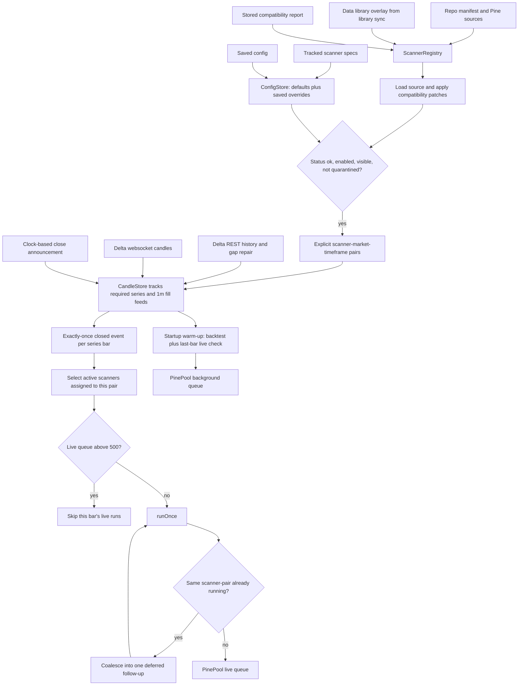
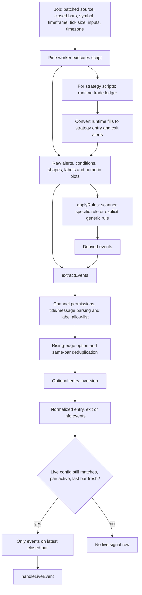
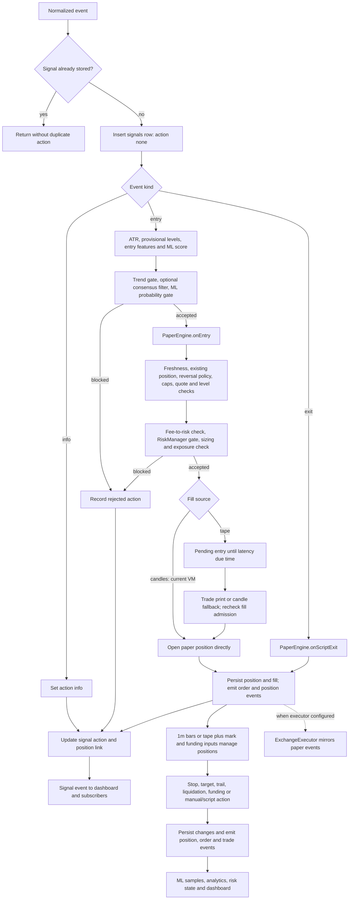

# Deployed VM: scanner and signal flows

Read directly from `/opt/vnedge` at commit **0176e01d89a32863fe86c9e0a9119c565e58b6d0**. Service active. Configuration observed **2026-10-03 17:34:26 UTC**: 10 enabled scanner configurations, 26 explicit pairs, execution `paper`, fill source `candles`, automatic tuning disabled, regime minimum ATR 0.3% and minimum ER 0.25. Enabled configurations still need registry/health eligibility to run. Configured latency is 1,500 ms, but the delayed pending-entry branch is conditional on tape mode; candle mode opens directly after admission.

Source was downloaded into `_research/vm-flows-20261003/snapshot/`. This is a read-only code trace; no service restart, order submission, or configuration change was made. The diagrams describe this deployed implementation, not a proposed redesign.

## 1. Scanner discovery and scheduling

Registry precedence: repo entries win over data-overlay entries with the same ID. The compatibility report can override manifest status; absent/short source becomes unavailable. Scanner specs provide reading defaults and saved per-scanner fields override them. A scanner absent from configuration is off.

`pairsFor` uses explicit pairs where nonempty, otherwise symbols × timeframes. Startup and normal close scheduling use those pairs. In this commit, `refresh()` and manual `runNow()` still enumerate separate symbol/timeframe lists; the final live check uses `runsOn` and prevents an out-of-pair trade, but extra background work can occur.

The candle clock announces a period after a 2,500 ms grace when the next websocket candle has not arrived. `lastClosedEmitted` guards duplicate close announcements. REST resync can announce the newest closed bar; signal age is checked later. This matters on thin markets where the first trade of the next period arrives late.

Source anchors: `scanners/registry.ts:49`, `config.ts:752`, `scanners/engine.ts:128–151,271–405`, `data/candleStore.ts:328–369`.

## 2. A Pine run becomes normalized events

This is a conceptual grouping of the checks; the source applies some checks earlier within each channel. Worker jobs use at least 50 closed bars. Ordinary live runs request the last three bars of alert/shape output, then extraction restricts to the latest closed bar. A warm backtest may use deeper history, requiring a separate live run on in-memory bars.

Numeric plots and labels do not automatically become entries. `applyRules` must interpret them through a named scanner rule or explicitly selected generic rule. New-label tracking avoids treating all existing drawings as newly emitted labels. A chart overlay can therefore look active while the normalized event list is empty.

The current deployed extractor already includes improvements over the earlier review: `conditionExit` recognizes supported stop/close conditions; diagnostic words such as bias/regime/sampling are excluded from generic directional titles; label allow-lists are applied before same-bar entry deduplication; BOS/CHoCH condition entries need explicit label opt-in. These checks do not create a complete typed contract for every family.

The worker pool prioritizes live work, applies queue deadlines, times out long runs, and normally recycles workers after 24 jobs. Failures update scanner health and may quarantine the scanner. `scanner_runs` stores the latest run per scanner/symbol/timeframe, not a complete historical run funnel.

Source anchors: `pine/worker.ts:87–126`, `pine/pool.ts:18,33,146`, `scanners/rules.ts:182`, `scanners/extractor.ts:239–367`, `scanners/engine.ts:370–449`.

## 3. Stored signal to paper position, exit and learning

The stored signal boundary is `handleLiveEvent`: it inserts a row **before** entry gates, then updates its action. A rejected entry can therefore appear in the signal feed. A raw output rejected by extraction never reaches that feed. Duplicate detection also happens before action processing.

Entry admission has an important ordering detail: an allowed opposite-side reversal can close the existing position before the new entry passes later quote, fee, risk and sizing checks. The actual implementation is not a single atomic “approve both legs” operation.

RiskManager checks manual/daily/weekly halts, total/symbol/scanner position budgets, scanner daily loss and cooldown, market verdict, optional weekend/ATR/ER regime checks, and drawdown scaling. Exposure checks follow sizing. Missing market verdicts or unavailable metrics do not uniformly reject; the diagram represents the calls, not a guarantee that every data gap fails closed.

In candle mode, scanner admission opens the paper position immediately using configured pricing/impact assumptions; 1m events subsequently manage it. In tape mode, entry is pending and can fill, expire, be cancelled, or be dropped on restart. Pending completion can update the signal later. Positions belonging to disabled scanners continue to receive price-driven exit management.

Paper position/fill writes and signal-action updates are separate calls in this commit. The visual grouping above does not imply one database transaction. An exception can interrupt that sequence.

The current execution mode returns **no exchange executor**. Other supported configurations instantiate dry-run or authenticated exchange transport; `ExchangeExecutor` listens to paper `order` and `position` events, serializes handling, manages brackets and reconciles exposure. A paper fill is not itself proof of an exchange-confirmed fill.

Dashboard updates use SSE `/api/events`; stored signals are queried through `/api/signals`. Paper events also feed trade learning and risk state.

Source anchors: `scanners/engine.ts:475–521`, `paper/engine.ts:256–393,452–489`, `risk/manager.ts:138–184`, `execution/wiring.ts:14–33`, `execution/testnet.ts:107–108,608`, `api/server.ts:142–176,283`.

## 4. Research, incubator and the two different shadow paths

```mermaid
flowchart LR
    LIB[Library registry] --> SCREEN[Separate CLI daily incubator screen]
    SCREEN --> HIST[Historical script run, extraction and backtest]
    HIST --> STORE[Screen results and pair stages]
    STORE --> SH[Incubator ShadowRunner]
    BAR[Live closed bars] --> SH
    SH --> BOOK[Separate PaperEngine book 2]
    BOOK --> EVAL[Evaluate prospective shadow evidence]
    EVAL --> PROP[Proposed pair]
    PROP --> PROM[Manual approval or configured auto-promotion]
    PROM --> CFG[Update fleet scanner configuration]
    CFG --> LIVE[Active fleet scheduler]
    LIVE --> SIG[Emitted stored signals]
    SIG --> VS[Validation ShadowLedger variants]
    CACHE[Historical candle cache] --> WF[Walk-forward ValidationService]
    WF --> WFR[Persist walk_forward results]
    WFR --> TUNE[OOS-aware tuning lookup when used]
    TUNE --> CFG
```

These are separate implementations:

| Path | Trigger and output | Important difference |
|---|---|---|
| Fleet warm backtest | Startup/manual/background run → `backtests`, optional ML training samples | Reuses fleet extraction options, but its backtest call does not pass every live execution override/gate. |
| Walk-forward validation | Historical jobs → `walk_forward` results | Independent extraction and simulation call. Inspect parity before treating it as the live strategy's result. |
| Daily incubator screen | Separate process → screen records and candidate stages | Entry-centric screening; silence/reading omissions can prevent a candidate progressing. |
| Incubator shadow | Live bars → dedicated paper book `bt=2` | Same market-feed infrastructure, but independent scanner runner and admission wiring. |
| Validation shadow | Fleet signal events → comparative variant ledger | It receives already-extracted fleet signals; it cannot recover outputs that never became signal rows. |

The incubator shadow extractor in this commit passes sources and edge, but **omits label filters and inversion**. Its paper engine is not assigned the account RiskManager; App assigns `paper.risk` only to the account book. It has a large synthetic balance and position allowance, and its runner applies the trend gate. Therefore “same paper logic” must not be read as identical fleet eligibility or extraction.

Source anchors: `app.ts:83–140,542–557`, `incubator/shadow.ts:49–141`, `cli/incubate.ts:110–150`, `validation/routes.ts:25–40`, `validation/service.ts:152–168`, `validation/shadow.ts:82`.

## 5. Where to look when a scanner has no signal

| Stage | Possible stop | Inspect |
|---|---|---|
| Registry/config | Unavailable, incompatible, disabled, hidden, quarantined or pair not assigned | Effective registry, resolved scanner config, health |
| Candle scheduling | Not tracked, insufficient bars, stale/resync data or close not yet announced | CandleStore state and close/integrity events |
| Work admission | Queue skip, deadline expiry, in-flight coalescing | PinePool and scanner logs |
| Script execution | Runtime error, unsupported secondary series or warm-up needs | Worker result and scanner health |
| Interpretation | Only drawings/state, no adapter, excluded channel/title/label, suppressed duplicate | Raw outputs → rules → extractor comparison |
| Live admission | Configuration changed, pair removed, old bar, no latest-bar event | runOnce live guards |
| Signal persistence | Duplicate signal | signals identity/deduplication |
| Entry gates | Trend/consensus/ML rejection | Stored signal action |
| Position admission | Existing position, quote/level/fee/risk/size/exposure rejection | Stored action, risk rejects, position book |
| Fill lifecycle | Tape pending, expired or cancelled; current VM instead uses direct candle-mode admission | Pending entries, position/fill ledger |

This is the diagnostic sequence to use for recovery. A missing position is not enough to conclude that the Pine script failed or found no setup.

## Source snapshot and method

All file anchors above are relative to the saved VM snapshot, not the potentially newer working tree. Start at [App wiring](/Users/scorpion/Desktop/Vela_VNEdge/_research/vm-flows-20261003/snapshot/server/src/app.ts:75), [scanner engine](/Users/scorpion/Desktop/Vela_VNEdge/_research/vm-flows-20261003/snapshot/server/src/scanners/engine.ts:271), [extractor](/Users/scorpion/Desktop/Vela_VNEdge/_research/vm-flows-20261003/snapshot/server/src/scanners/extractor.ts:276), and [paper engine](/Users/scorpion/Desktop/Vela_VNEdge/_research/vm-flows-20261003/snapshot/server/src/paper/engine.ts:256).

This deliverable is constructed from deployed source and selected configuration observations. It is not a runtime trace of every branch or a new performance test.
